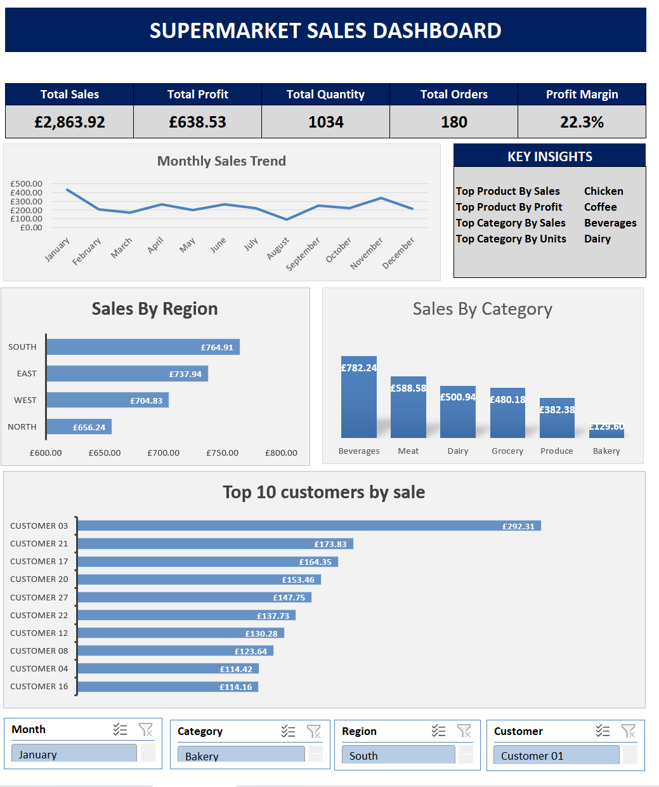

# supermarket-sales-analysis-excel
Interactive supermarket sales analysis and excel dashboard using Pivot tables, Pivot charts, Slicers, KPIs and data analysis.
# Supermarket Sales Analysis & Excel Dashboard

## Project Overview

This project analyzes supermarket sales data using Microsoft Excel to identify
sales trends, regional performance, product performance, customer performance,
and category-level insights.

An interactive Excel dashboard was developed using PivotTables, PivotCharts,
KPI calculations, and slicers to allow users to explore the sales data
dynamically.

## Business Objective

The objective of this project was to transform raw supermarket sales data into
a clear and interactive management dashboard that can help answer questions such as:

- What are the overall sales and profit?
- Which months generate the highest and lowest sales?
- Which region performs best?
- Which product generates the highest sales?
- Which product generates the highest profit?
- Which category generates the highest sales?
- Which category sells the most units?
- Which customers generate the highest sales?

## Tools & Technologies

- Microsoft Excel
- Excel Tables
- Excel Formulas
- PivotTables
- PivotCharts
- Slicers
- Data Analysis
- Dashboard Design

## Dataset

The dataset contains supermarket transaction-level sales information,
including:

- Order ID
- Date
- Region
- Customer
- Product
- Product ID
- Category
- Unit Price
- Quantity
- Discount
- Sales
- Cost
- Profit
- Channel

## Project Structure

The Excel workbook contains the following sheets:

### Source
Contains the original/raw supermarket sales data.

### Sales_Data
Contains the prepared sales dataset with additional fields used for analysis,
including month-related fields.

### Analysis
Contains product and category-level analysis and key business insights.

### PVT_Chart
Contains PivotTable outputs used to create the dashboard visualizations.

### Dashboard
Contains the final interactive supermarket sales dashboard.

## Key Performance Indicators

The dashboard tracks:

- Total Sales
- Total Profit
- Total Quantity
- Total Orders
- Profit Margin

## Key Insights

Based on the complete dataset:

- Total Sales: £2,863.92
- Total Profit: £638.53
- Total Quantity Sold: 1,034
- Total Orders: 180
- Profit Margin: approximately 22.3%
- Highest Sales Product: Chicken
- Highest Profit Product: Coffee
- Highest Sales Category: Beverages
- Highest Units Sold Category: Dairy
- Highest Sales Region: South

## Dashboard Features

The dashboard includes:

- Monthly Sales Trend
- Sales by Region
- Sales by Category
- Top 10 Customers by Sales
- KPI Cards
- Key Business Insights
- Interactive Month Slicer
- Interactive Category Slicer
- Interactive Region Slicer
- Interactive Customer Slicer

## Analysis Process

The project followed these main steps:

1. Imported and reviewed the raw sales data.
2. Prepared the dataset for analysis.
3. Created calculated fields and supporting analysis.
4. Built PivotTables for products, categories, regions, months, and customers.
5. Created PivotCharts to visualize the results.
6. Added KPI calculations for sales, profit, quantity, orders, and margin.
7. Added slicers for interactive filtering.
8. Designed an interactive management dashboard.
9. Identified key business insights from the analysis.

## Dashboard Preview

## What I Learned

Through this project, I developed practical experience in:

- Data cleaning and preparation
- Excel data analysis
- PivotTable development
- PivotChart creation
- KPI design
- Interactive dashboard development
- Business insight generation
- Data visualization
- Presenting analytical findings in a business-friendly format

## Future Improvements

Possible future improvements include:

- Connecting the dashboard to a larger dataset
- Automating data refresh
- Adding year-over-year analysis
- Adding sales forecasting
- Adding more advanced profitability analysis
- Rebuilding the dashboard in Power BI
- Connecting the analysis to a SQL database

## Author

Sunitha Madhavadhas

LinkedIn: www.linkedin.com/in/sunitha-madhavadhas-610676167

GitHub: https://github.com/msunith
